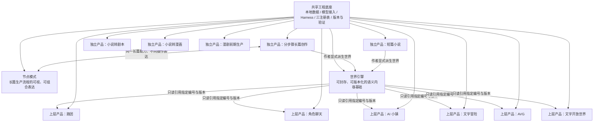
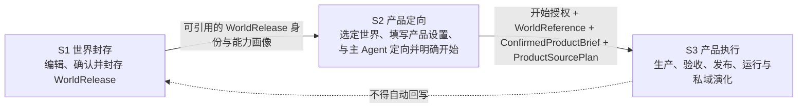
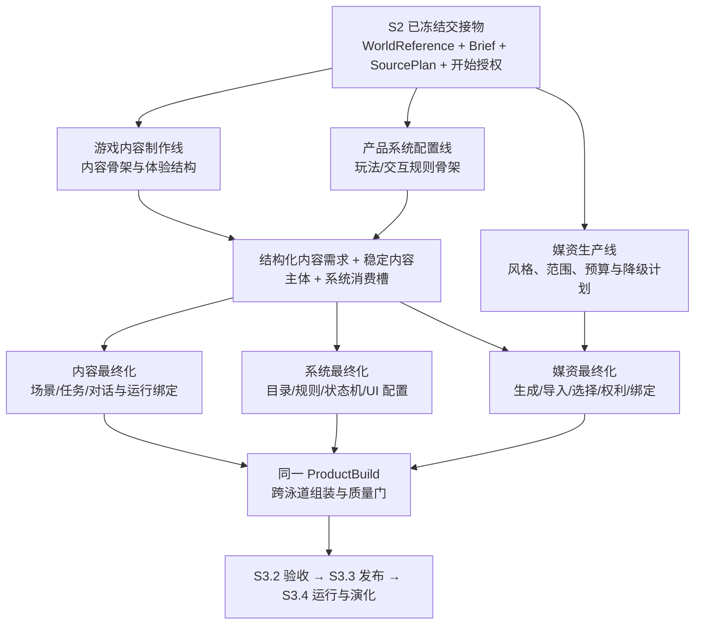

# StoryForge 项目总纲

> 文档版本：1.9.0<br>
> 生效日期：2026-09-28<br>
> 状态：现行、最高产品总纲<br>
> 适用范围：StoryForge 主干、所有开发分支、工作树、产品设计、数据设计、Agent/Harness、测试、文档与未来平台建设

## 1. 文档目的与权威

本总纲用于回答 StoryForge 长期不应反复改变的根本问题：项目是什么、由哪些彼此独立或共享基础的产品组成、数据怎样流动、Agent 怎样参与生产与运行、哪些边界不得跨越，以及开发工作应按什么顺序推进。

本总纲不是阶段施工记录，也不是某一功能的详细设计。它是所有详细架构、产品方案、路线图和开发任务的上位依据。任何分支都不得仅因局部实现方便而改变这里确立的产品关系与数据边界。

### 1.1 规范用语

- “必须”“不得”表示不可绕过的项目约束。
- “应”表示默认必须遵循，只有形成书面理由、影响分析和复审条件后才可例外。
- “可”表示允许选择，不表示已经实现。
- 世界衍生产品的三个阶段只使用规范短名 `S1 世界封存`、`S2 产品定向`、`S3 产品执行`。描述性长句只能解释阶段内容，不得形成另一套阶段名称。
- 本文描述的是目标产品边界。当前代码与本文不一致时，应登记为待纠偏项，不得反向用旧代码改写总纲。

### 1.2 文档裁决顺序

发生冲突时，按以下顺序裁决：

1. 本项目总纲。
2. 现行产品地图、能力基线与路线图。
3. 项目开发宪法以及架构、数据、Harness、质量和发布规范。
4. 三个核心注册表及其代码契约：`CONTEXT_SOURCES`、`FIELD_REGISTRY`、`PROJECT_TABLES`。
5. 各独立产品的详细设计、数据契约、Agent/Skill/Run Contract 和测试规范。
6. 当前施工计划、任务卡和历史决策记录。

历史蓝图、旧路线图、完成报告和过时设计只能作为溯源材料，不再具有现行设计权威。

## 2. 项目定位

StoryForge 是面向叙事创作与叙事体验的 AI 原生生产系统。它不是单一小说编辑器，也不是把所有能力塞进“世界引擎”的一个巨大功能；它由多项可独立成立的创作产品、一个可被上层产品引用的世界引擎，以及一套共享工程底座构成。

项目的长期目标是让用户能够：

- 完成从设定、故事、角色、大纲、细纲到百万字级正文的长篇创作；
- 以更轻量的方式完成短篇小说；
- 将一句话或已有小说转换为剧本、完整漫画，或可交给外部视频工具的漫剧前期生产包；
- 创建、封存、分享和复用具有稳定编号与版本的世界引擎；
- 在某个世界引擎基础上生成并运行跑团、角色聊天、AI 小镇，以及明确收口为文字冒险、AVG、文字开放世界的三类文字游戏；
- 让每种产品都能在用户定向后由主 Agent 自主规划、生产、组装、检查、修复并交付，而不是要求用户逐个管理内部生产步骤。

当前阶段优先完善真实可用的功能和工程质量。网站、账户、社区、市场、平台与商业化属于核心产品能力稳定后的后续阶段，不能反向挤占当前功能完整性建设。

### 2.1 产品能力研发与作品生产是两条生命周期

StoryForge 的**产品能力研发**与用户使用这些能力完成一次**具体作品/游戏生产**是两条独立但衔接的生命周期，不得写进同一张无边界待办或用一方的完成证据冒充另一方。

- 产品能力研发负责建立某个产品的专项契约、作者端和玩家端 UI、领域数据、三注册表、Agent/Skill/Harness、编译器、运行时、存档、迁移、测试和 StoryForge 应用发布。任务系统、背包系统、战斗引擎、地图交互和基础玩家界面首先是产品代码，应由产品工程实现并维护。
- 具体作品生产负责在已经存在的产品能力上创建该实例的内容、系统配置和媒资，形成 product production、Artifact、Build、ProductRelease、session 和 save。本游戏有哪些任务、物品、地区、数值、角色图和背景属于作品生产，不应为每个实例重新生成一套未经治理的软件实现。
- 世界衍生产品的 `S1 世界封存 → S2 产品定向 → S3 产品执行`描述具体产品实例/游戏的生产与运行，不替代 StoryForge 产品能力自身的研发、合并和应用发布流程。`ProductRelease` 是某个作品的不可变运行版本，不是 StoryForge 应用版本。
- 独立创作产品同样必须区分产品能力与具体作品，但各自使用自己的生产生命周期，不因本节而被强制套用 S1/S2/S3。

产品专项方案开工时必须先说明讨论的是“实现产品能力”还是“使用能力生产一个作品”，再定义两者在配置、编译和运行处的交界。

## 3. 产品全景与关系



这张图表达三项不可混淆的关系：

1. 分步骤长篇、短篇、小说转剧本、小说转漫画、漫剧前期生产都是可以独立使用和独立验收的产品。
2. 节点模式不是第二套长篇系统，而是同一套长篇生产能力的可视化、可拆装操作方式。
3. 世界引擎是上层衍生产品的只读内容来源，不是全部创作产品的父模块，也不接收上层产品运行数据的自动回写。
4. 长篇和短篇保持独立 owner，同时允许作者把已确认内容显式、一键派生为世界草稿或封存版本；小说转剧本、小说转漫画、漫剧前期生产当前不提供该派生路径。

## 4. 独立创作产品

### 4.1 分步骤长篇创作

分步骤长篇创作是当前用户正在使用的核心产品，必须保持完整、独立和可单独运行。它不以世界引擎为前置条件，也不得通过隐藏依赖把自己的数据读写、记忆或生成过程迁入世界引擎。

它覆盖完整长篇生产体系：

- 项目与创作目标；
- 世界观及其分层设定；
- 故事核心、主题、冲突与叙事设计；
- 角色、关系、物品、地点、组织等实体；
- 主线、支线及其持续演化；
- 大纲、卷章结构、细纲与场景规划；
- 正文生成、扩写、重写、润色、采纳、版本与人工编辑；
- 事实、伏笔、状态、关系、时间线、叙事承诺和长程记忆；
- 候选生成、刷新恢复、过期阻断、采纳后下游生效和可追溯运行证据。

此前 Harness 重构的首要服务对象就是这条分步骤长篇流程。长篇是否真正完成，不以“按钮可以请求模型”为准，而以完整数据闭环、长程一致性、可恢复性、可验证性和真实创作结果为准。

长篇体系的目标上限是支持百万字级创作。上下文窗口大小不是实现该目标的充分条件；系统必须通过结构化事实、原文留存、按需检索、渐进式披露、事件与版本记录，使晚出现和低频但关键的信息仍有机会被准确召回。

现行 Phase 5 工程基线已经完成世界观、故事、角色、主支线、大纲、细纲、正文、章后/未来演化、长程记忆、真实 API 纵切面和 10万/30万/100万字符工程规模门。长期作者项目与文学一致性继续作为质量研究，不得因此把已经完成的分步骤主链重新列为待开发功能。

### 4.2 节点模式

节点模式与分步骤模式的关系，类似 ComfyUI 与一个封装好的 Stable Diffusion 工作流：分步骤模式提供经过设计的标准操作路径，节点模式把同一生产过程公开为可查看、可填写、可连接、可复用的节点图。节点模式是操作表达上的超集，可以比标准步骤更细、更自由、更可调，但不是领域能力、Canon 或 Harness 上的第二套系统。

节点模式必须遵守以下约束：

- 节点对应真实的长篇能力、数据源、动作或产物，不得只是视觉占位符。
- 分步骤模式与节点模式共用同一数据契约、Skill、Agent/Harness、上下文来源、采纳入口和三注册表。
- 一个模式产生的受治理数据，另一个模式能够按同一版本与作用域读取。
- 不得复制第二套 AI 调用、数据库写入、导入导出、迁移或记忆体系。
- 节点图必须具有类型、作用域、依赖、输入、输出、版本和运行证据；非法连接应在执行前被阻断。
- 标准分步骤流程应能够表达为官方节点模板；用户可在不破坏数据治理的前提下拆分、替换、组合和保存自己的工作流。

### 4.3 短篇小说

短篇小说是从长篇创作能力中提炼出的独立轻量产品。它可以复用共享的模型接入、创作 Skill、候选采纳和质量验证，但不得只是长篇页面的一个开关。

短篇与长篇的主要区别是规模、规划粒度和记忆复杂度，而不是放弃结构和质量。短篇仍应有明确的创作意图、结构规划、正文生产、版本与修改闭环，只是不需要默认承担百万字级持续状态管理。

短篇和长篇一样可由作者显式派生为世界草稿或封存版本。派生保存来源作品、revision、选取范围和 content hash，不改变短篇 owner，也不让后续修改自动同步到已封存世界。

### 4.4 小说转剧本

小说转剧本是一条独立的端到端 Agent 生产流程，不是格式替换工具。它需要将源小说解析为可追踪的叙事事实、场景、人物、动作与对白，再根据目标剧本类型完成结构改编、场次设计、节奏重构、格式化、审校与交付。

详细设计必须单独定义其输入契约、改编策略、场景与角色连续性、源文证据、删改说明、剧本格式、验证器和人工复审点。项目既有实践与数据在该产品开工时作为专门输入审查，不能仅凭通用提示词代替流程设计。

### 4.5 小说转漫画

小说转漫画是独立的完整 Agent 产品，至少包含：

1. 小说理解与可追踪事实提取；
2. 从小说到漫画脚本的改编；
3. 页、格、镜头、节奏、对白与视觉表现设计；
4. 角色、服装、场景、道具和风格资产生产；
5. 人物一致性、表情、动作、构图与镜头连续性控制；
6. 对话框、拟声、文字强调、错位排版、夸张或变形等漫画语言；
7. 生图、选图、修复、排版、审校和成品导出。

它可以复用共享媒资生产设施，但必须拥有自己的漫画语义、产品表、生产状态、验证规则和组装流程。世界引擎不预先为它生产或保存漫画媒资。

### 4.6 漫剧前期生产

漫剧前期生产是独立产品，用户可在一条分步骤流程中从一句话或已有小说开始，完成小说来源冻结、系列策划、分集推进、漫剧剧本、角色/服装/场景/道具/声音物料、逐镜分镜、分镜图/首尾关键帧提示词与参考帧、视频 Prompt IR 和 Seedance/Runway/LTX 等版本化工具适配包。

一句话入口复用小说产品的创作能力；小说正文继续由 Novel Work 拥有，漫剧只保存显式冻结的来源范围、revision、hash 和 lineage。系列、分集、剧本、物料、媒资、shot、Prompt IR 和前期生产 Release 由 MotionDrama Work/Release 拥有，不写入小说、页漫、世界引擎或上层产品表。

该产品采用“系列与主体物料一次建立、逐集打磨和锁定”的生产节奏。正式 AI 调用仍须进入登记 Skill 和可恢复的有限步骤 run，但不建立一个自动跑完整季的无限 Agent。

产品终点停在外部视频生成之前。视频生成、抽卡/选片、剪辑、字幕成片、调色、混音和发布运营不属于当前交付范围。

## 5. 世界引擎

### 5.1 定义

世界引擎是一个可编辑、可确认、可封存、可版本化、可被引用的叙事语义内容包。它像一部可供继续创作和推演的“书”或“世界档案”，内容丰度由创建者决定，而不是要求所有字段都填满。

世界引擎可以只包含世界观，也可以逐步包含：

- 基础世界设定；
- 故事、主题、冲突与叙事规则；
- 角色、关系、物品、地点和组织；
- 主线、支线及阶段性状态；
- 大纲、细纲、章节和场景；
- 小说正文以及由正文确认的事实与事件。

完整度是一种可声明、可检测的能力画像，不是二元的“完整/不完整”。上层产品读取世界引擎时必须知道所引用版本实际提供了哪些能力，并对缺失内容给出补充设计方案或明确限制。

### 5.2 编号、版本与封存

- 每个可共享世界引擎必须有稳定的唯一编号。
- 每次对外可引用的封存结果必须有不可变版本标识。
- 修改中的草稿与已封存版本必须区分；修改草稿不得静默改变已存在的上层产品。
- 上层产品必须记录所引用的世界编号、版本和完整度画像，从而可重复构建与追溯。
- 未来的复制、分享和社区引用建立在版本化快照上，而不是直接共享可变的浏览器记录。
- 世界可以从空白创建，也可以由作者从已有长篇或短篇的已确认语义内容一键派生；系统自动完成选取、投影和快照，用户不需要复制粘贴。
- 派生关系必须保留来源作品、来源 revision、范围和 hash；原作品继续独立，世界草稿/版本与原作品后续修改互不自动覆盖。
- 小说转剧本、小说转漫画、漫剧前期生产当前不作为世界派生来源；未来若改变必须另行修改产品契约。

### 5.3 明确排除媒资

世界引擎只保存创作语义与必要的结构化内容，不包含面向具体上层产品生产的图片、音乐、音效、配音、视频、UI 皮肤或成品排版。

角色外貌、地点氛围、时代风格等可以作为语义设定存在；据此生成的角色立绘、游戏背景、漫画分镜、音乐和界面资产，必须在引用世界的上层产品生产阶段按具体体验需求创建并归该衍生产品所有。

不得为了“方便复用”重新把产品媒资塞回世界引擎。真正可复用的媒资能力应由共享媒资基础设施提供，而不是污染世界内容边界。

### 5.4 中立的版本化资源出口

世界引擎必须提供稳定、版本化、可查询的资源协议，使上层产品能够描述版本、搜索资源并按需读取详情与原文。这里统一的是 **寻址、版本、来源、权限、充分性和遗漏语义**，不是要求所有产品接收同一个固定数据包。

- 世界引擎公开资源目录、能力画像、稳定 resource ID、来源 release/hash 和可查询关系；
- 每个上层产品用自己的需求适配器表达“本产品当前任务需要什么”，其中可包含稳定必读、建议/选读、随用户目标变化的条件读取和禁止读取；不得把跑团、聊天或某类游戏的字段固化成世界引擎的通用清单；
- 网关根据需求返回匹配、缺失、冲突、未读取和证据位置，先给目录与摘要，再按需渐进式披露详情和原文；
- 在用户确认开始生产时，产品冻结世界版本、需求适配器版本、需求、读取权限及咨询阶段 Context Manifest 证据为 `ProductSourcePlan`；生产中可在该不可变版本内继续渐进式检索，每个 durable run 留下不可变 Context Manifest，发布时聚合并冻结为 `ProductSourceManifest`；后续 runtime 的新读取归 session/run manifest，不能修改已发布 manifest；
- 新产品接入时新增产品侧需求适配器和必要的资源类型登记，不修改一个不断膨胀的“全产品统一 payload”。

需求适配器可以由类型化代码/配置与产品 Skill 协作实现：代码/schema 负责版本、权限、必读、禁止和条件边界，Skill/Prompt 负责把开放式用户目标转换成语义查询。上层产品不得直接查询世界底层表或维护其物理字段清单；世界引擎也不得预先猜测每种未来产品的全部输入需求。

## 6. 世界引擎之上的衍生产品

### 6.1 适用范围

跑团、角色聊天、AI 小镇、文字冒险、AVG 和文字开放世界属于“引用世界后产生的上层产品”，统一遵守本章的三阶段主链。文字游戏的用户可见产品分类只有文字冒险、AVG、文字开放世界三种；状态推演、互动和演出是具体产品的内部能力，不另立产品身份。分步骤长篇、短篇、小说转剧本、小说转漫画和漫剧前期生产是独立创作产品，不得为了套用这条主链而被强制世界化；它们各自拥有独立生产生命周期。长篇或短篇由作者显式派生世界时，三阶段只从形成 WorldRelease 后开始，不改变源作品的独立产品身份。

### 6.2 三阶段主链

三个规范短名分别是：`S1 世界封存`、`S2 产品定向`、`S3 产品执行`。它们是跨产品的所有权、授权和交接边界，不要求拆成三个页面，也不自动对应三张表或一套全产品通用状态枚举。



#### S1 世界封存

目标是把用户确认的世界语义变成可稳定引用的版本。用户创建、导入、编辑和确认世界内容后执行封存；系统校验作用域、引用、能力画像和版本身份，生成不可变 `WorldRelease`，并使其可通过 `worldCode + WorldRelease ID + content hash + capability profile` 唯一定位。长篇或短篇显式派生世界时，也必须先在这里形成独立的世界草稿或封存版本，原作品 owner 不变。

S1 只拥有世界草稿、确认语义、封存版本及其来源证据。它不创建某个跑团、聊天或游戏的配置、媒资、production、build、session、运行状态或私域故事。

#### S2 产品定向

目标是让用户确定“基于哪个冻结世界，制作什么产品”。用户进入某个上层产品后，选择世界编号和准确封存版本；系统生成并校验 `WorldReference`，展示与本产品相关的世界能力和缺口。用户在 **该产品自己的交互空间** 填写专用设置，并与该产品主 Agent 确认目标、限制和方向。产品可只读分析世界、提出建议和估算，但不得修改来源世界，也不得提前创建正式 production、媒资或 runtime。

规模、时长、是否需要结局、参与者、体验风格等是否存在及如何表达，均由具体产品契约决定；总架构不建立一张覆盖所有产品的万能配置表。主 Agent 可以起草 `ConfirmedProductBrief` 和 `ProductSourcePlan`，但 Brief 必须由用户确认，plan 必须由系统校验世界版本、需求适配器、权限与缺失策略。只有用户明确点击或下达“开始”指令，系统冻结 `WorldReference`、Brief、SourcePlan 和授权 revision 后，才允许进入 S3。

#### S3 产品执行

目标是把 S2 已确认并授权的目标交付为可发布、可运行、可继续演化的具体产品。正式生产只能使用冻结的 `WorldReference`、`ConfirmedProductBrief` 和 `ProductSourcePlan`，由本产品主 Agent 按本产品契约调度专业 Skill、Agent 与确定性服务。

S3 内部统一使用四个定位点，但各产品可以拥有完全不同的实现：

- **S3.1 生产**：需求适配器声明必读、选读、条件读取和禁止读取；Context Gateway 在同一个不可变 WorldRelease 内渐进读取并为每个 run 留下 Context Manifest；可运行游戏产品以游戏内容制作、产品系统配置和媒资生产三条依赖式并行泳道形成可组装产物。
- **S3.2 验收**：确定性组装 ProductBuild，以局部可玩切片迭代执行结构、引用、媒资、权限、质量、恢复和真实体验检查；问题必须能定位到受治理产物，修复有界、可见并按依赖闭包局部重建和重放。
- **S3.3 发布**：冻结不可变 `ProductRelease`、由真实 run manifests 聚合的 `ProductSourceManifest`，以及由发布系统生成的父版本、构建、兼容、运行时 AI 和验收成熟度证据。正式 release 表示可重复运行，不自动表示已经完成独立玩家或公开分发验收。
- **S3.4 运行与演化**：runtime/session 绑定准确 ProductRelease，运行中新读取、记忆、状态、选择与私域演化均归产品实例。仍在原 Brief/SourcePlan 和运行时 AI 契约内的演化可继续有限 run；目标、设置、世界版本、资源需求或权限变化时必须返回 S2 重新定向。运行问题修复形成新的 ProductRelease，不追写旧版本。

##### S3.1 的三条依赖式并行生产泳道

跑团、角色聊天、AI 小镇、文字冒险、AVG 和文字开放世界都是最终需要被用户实际运行的游戏型上层产品。它们在 S3.1 中都必须明确覆盖以下三种生产职责：

1. **游戏内容制作线**：把冻结来源和产品 Brief 转换成玩家将实际经历的内容，包括但不限于角色与关系、故事与冲突、地区与地点、模组或章节、主支线、任务与事件、场景、对白、选项、结局及运行时可消费的文本表现。模型可以承担创意和语义工作，但正式结果必须成为有稳定身份、来源、版本、引用和验证证据的结构化 Artifact，不能以一段未治理的自然语言直接冒充可运行内容。
2. **产品系统配置线**：把产品意图和内容需求转换成游戏如何运行的可执行规则，包括但不限于角色或席位状态、成长与资源、判定或战斗、物品与经济、任务生命周期、地图与时间、关系与知识、行动/条件/效果、导演或调度规则、存档分支、UI 消费槽和运行模块配置。模型可以提出世界化语义和有限候选；稳定 ID、数值边界、公式、状态机、权限、引用、幂等、事务与最终配置必须由确定性代码拥有。
3. **媒资生产线**：根据已确认的内容主体和产品消费槽形成地图、图标、头像/立绘、场景背景、UI 皮肤、音乐、环境音、音效、配音或其他产品媒资的需求、生成/导入、选择、修复、权利、版本和绑定。媒资只能表现已存在的内容与系统消费需求，不得反向发明世界事实、角色身份或任务结果；生成失败时只能按产品契约使用明确的程序化、文字、占位或静音降级，不能留下悬空引用。

三条泳道是跨游戏产品统一的**职责闭环**，不是三张万能表、三个固定页面、三个常驻 Agent，也不要求所有产品拥有相同复杂度。每个产品必须在自己的 Brief、Production Contract 和质量门中声明每条泳道的实际范围、必需项、可选项、降级方式、Artifact owner 和完成条件。媒资较轻的产品仍须明确“需要什么、为何不生产、使用何种降级、由谁消费”；不能用“纯文字”作为省略媒资 owner、绑定和发布行为的理由。

S2 的“产品设置”与 S3 的“产品系统配置”不得混淆：S2 确认用户要制作什么，例如规模、主角、体验风格、内容边界、媒资偏好、预算和完成条件；S3 才决定该产品怎样运行，例如属性/资源、行动规则、任务状态机、关系与知识、存档、UI 投影和运行模块。S2 设置可以约束 S3，但不能提前冒充已经生产并验证的系统配置。



这里的“并行”表示由依赖图约束的 fan-out/fan-in，而不是三条线从第一秒起互不等待：

- 三条线共享同一份冻结 Brief、SourcePlan、产品身份、预算和 Build 边界，不能各自解释出三个产品。
- 内容骨架与系统规则骨架可以较早并行；多个故事线、地区、系统目录或独立媒资也可以在读写集不冲突时并行。
- 内容线必须把任务、场景和体验需要转成结构化需求；系统线据此生产技能、物品、敌人、规则或其他运行目录，再与内容完成稳定引用绑定。不同产品可以没有传统任务或战斗，但仍必须形成自身内容与运行规则的等价绑定。
- 媒资风格、范围、预算和降级策略可以提前规划；最终媒资生产必须等待角色、地点、场景、UI 槽或其他消费主体稳定，避免图片、声音或 UI 反向决定 Canon。
- 每条线只提交本线拥有的候选和证据；跨线正式引用由确定性组装器完成。任何修改都以新 Artifact/Build 表达，并按依赖闭包使下游失效和重验，不得形成互相原地改写的循环。
- S3.2 必须同时验证三条线自身质量及内容—系统、内容—媒资、系统—UI/媒资之间的跨线引用。只有同一 Build 的必需产物、允许的降级和质量证据全部闭合，才能进入 S3.3。

三条泳道汇合并不代表 S3 已经结束。它们只完成 S3.1；之后仍必须经过 Build 验收、不可变发布以及绑定准确 ProductRelease 的运行与私域演化。

##### ProductBuild 组装、可玩切片与局部返修

三条泳道通过确定性的 Build Integrator 汇合。它负责解析和校验跨泳道引用、owner、版本、作用域与消费槽，编译运行包和 UI 投影，生成缺失、冲突、悬空引用、未消费产物、降级及质量报告，并记录输入 Artifact、编译器版本、Source Manifest 和构建证据。Agent 可以解释问题和提出候选修复，但不能自报组装成功、引用闭合或发布证据。

Build Integrator 是横切组装职责，不是第四条创意生产泳道，也不要求六类产品共享同一个内容 schema。每个产品拥有自己的编译器/组装契约；只有已经被真实纵切面证明相同的构建设施才可进入共享底座。

S3.1 与 S3.2 必须支持以下短反馈循环，而不是只能全量生成后一次验收：

```text
形成局部可玩切片
→ 立即试玩或自动重放
→ 将问题定位到 Artifact / 系统配置 / 媒资 / 编译结果
→ 作者直接编辑或 Agent 定向提出候选修复
→ 按依赖闭包使受影响下游 stale
→ 只重建必要部分
→ 重放受影响路线和反例
→ 合格后扩大到下一切片
```

任何返修都以新 revision、Artifact 或 Build 表达；已经发布的 ProductRelease 不得原地覆盖。自动路线只能证明相应路径可执行，不能替代玩家从实际可见信息中理解目标、找到路径和评价体验。

S3 不得读取可变世界草稿、越过 SourcePlan、追写旧 ProductRelease，或把运行和私域演化自动回写 S1。下一轮演化何时触发、怎样推进和何时结束，由具体产品功能决定；总架构只要求有限可恢复的执行单元和明确版本谱系。

### 6.3 跨阶段交接物与闸门

下列名称表示逻辑契约；具体产品可以使用自己的物理表和类型，但必须能无歧义映射、查询和审计：

| 交接物 | 最小语义 | 所有者 | 架构闸门 |
|---|---|---|---|
| `WorldReference` | world code、不可变 release ID/hash、能力画像 | 产品引用；由系统生成并经世界网关校验 | 不允许以可变草稿或 `worldVersion` 文案冒充封存来源 |
| `ProductSourcePlan` | 锁定 WorldReference、需求适配器/版本、资源需求、读取权限、缺失策略和咨询 Context Manifest refs | 产品草稿/production | 用户开始时冻结；不得预先假装列全生产阶段会用到的资源 |
| `ConfirmedProductBrief` | 产品类型、用户意图、该产品专用设置、限制和版本 | 产品实例 | 未经用户明确开始，不得进入正式生产 |
| `ProductSourceManifest` | production 各 run 实际读取、采用、缺失、冲突、遗漏的世界资源与证据快照 | 产品 build/release | 只能聚合 SourcePlan 允许的 run manifests；ProductRelease 冻结 hash，runtime 不得继续修改 |
| `ProductReleaseLineage` | 产品 release、父 release、来源 plan/manifest、构建/兼容、运行时 AI 与验收成熟度证据 | 产品实例 | release 不可变；升级不能覆盖旧版本或旧存档；成熟度不得无证据提升 |

这五项首先是跨产品逻辑契约，不要求建立五张万能表，但每次真实生产必须留下可持久化、可重放的具体产物。系统根据用户选择的冻结版本生成并校验 `WorldReference`；主 Agent 可根据交互起草 `ConfirmedProductBrief` 和 `ProductSourcePlan`，Brief 由用户明确确认，plan 由系统校验版本、权限和需求适配器；`ProductSourceManifest` 只能从真实 run Context Manifests 聚合；`ProductReleaseLineage` 由发布系统根据父版本、build、quality、运行时 AI、成熟度和兼容证据生成并冻结。Agent 不得凭空自报读取历史、hash、成熟度或版本关系。

阶段可以由同一界面连续呈现，但所有权和持久化边界不得因此合并。任何从世界页面直接创建正式 runtime、跳过产品 Brief/授权，或让 runtime 读取变化中世界草稿的路径，都是架构绕行。

开放式 runtime 如需继续查询世界，只能继承 ProductRelease 中锁定的 SourcePlan，并为每个 session/run 另存 Context Manifest。它可以成为下一次产品演化的来源证据，但不能追写旧 ProductRelease 的 ProductSourceManifest。

产品自己决定何时触发下一轮演化。若演化仍在既有 Brief/SourcePlan 权限内，可以作为产品运行能力继续；若用户目标、产品配置、世界版本、资源需求或读取权限发生变化，则回到该产品的 S2 形成新 Brief/SourcePlan，再创建新 production/ProductRelease，不得修改旧 plan。

### 6.4 统一规则与产品专用规则

总架构统一规定：产品研发与作品生产分层、阶段顺序、数据所有权、不可变引用、显式开始、来源 plan/manifest、三泳道与确定性 Build 汇合、局部返修、版本谱系、验收成熟度、运行时 AI 最小边界、发布后维护、分发身份、失败恢复、权限与审计、媒资不归世界、运行不回写世界。

总架构不统一规定：某产品要填哪些表单、用小时还是章节表达规模、必须有几个结局、内部有几个 Agent、怎样设计规则和玩法、何时触发下一轮演化、怎样生成具体媒资。这些内容必须在开工时针对具体产品单独分析、形成专用契约和测试，不得被一次总体审计假装设计完成。

### 6.5 媒资生产属于 S3

媒资是 `S3 产品执行` 的正式产物。主 Agent 根据已确认的产品目标拆解角色、场景、UI、地图、音乐、环境音、音效、配音或其他资产需求，完成生成、选择、修复、绑定和版本管理。

共享媒资设施可以被多个产品复用，但每份媒资必须归属于明确的 product production/build/release。世界引擎只提供可用于创作媒资的语义依据，不保存这些成品。

### 6.6 产品类别只定义边界，不替代专项设计

- 跑团、角色聊天、AI 小镇、文字冒险、AVG 和文字开放世界是六个明确的上层产品边界；其中文字游戏严格只有后三种。不能用一个不断膨胀的页面、旧产品别名或任意字符串 `type` 冒充全部产品。
- 六类产品都必须经过 `S1 世界封存 → S2 产品定向 → S3 产品执行`，并在 S3.1 明确游戏内容制作、产品系统配置和媒资生产三条泳道。统一的是职责、所有权、交接、组装和验证方式，不是具体内容规模、规则复杂度或媒资数量。
- 它们可以共享三阶段外壳、世界资源协议、Harness、媒资设施、版本和恢复基础，但各自拥有产品设置、Agent 组织、生产图、运行状态与演化机制。
- 共享生产工厂只提供调度、证据、版本和恢复外壳；每条根记录必须冻结产品身份并进入该产品的需求适配器、生产模块、发布和运行边界。AI 小镇在具备自己的完整契约前只登记产品边界，不得借用其他产品入口伪装成已接入。
- 本总纲只确认这些产品的归属和共同流转方式。任何具体产品开工前，必须另行完成需求、数据、Agent、运行、质量与体验设计。

| 游戏型上层产品 | 游戏内容制作线的典型职责 | 产品系统配置线的典型职责 | 媒资生产线的典型职责 |
|---|---|---|---|
| 跑团 | 模组、场景、NPC、线索、遭遇和结局 | 规则包、人物卡、判定、回合、信息边界和主持运行 | 地图、标记、角色图、场景图和声音 |
| 角色聊天 | 角色人格、关系、开场情境、话题和可演化事件 | 对话状态、知识可见性、记忆、关系变化、安全和会话规则 | 头像/立绘、背景、表情动作和语音 |
| AI 小镇 | 居民、地点、生活线、事件、传闻和长期变化 | 时间、日程、知识、关系、轻经营、离线演化和导演规则 | 小镇地图、居民图、地点背景、环境音和 UI 表现 |
| 文字冒险 | 故事、分支、任务、场景、选择和结局 | Action、状态、资源、任务、判定、存档和分支规则 | 插图、背景、角色图、音频和产品 UI；可按契约降级为纯文字 |
| AVG | 剧本、分场、对白、分支和结局 | 选择/旗标、场景播放、回看、存档、跳读和演出控制 | 立绘、表情、背景、CG、音乐、音效、配音和 UI |
| 文字开放世界 | 主线、重要故事、地区生态、任务、事件、场景和长期内容供给 | 成长、战斗、物品、经济、地图、时间、NPC、导演、存档和运行时 AI | 程序地图、头像/立绘、地点/场景背景、UI 和声音资产 |

上表只说明职责映射，不是实现完成度声明，也不形成共享字段清单。一个产品可以比示例更轻或更重，但不能把别的产品的内容、系统配置或媒资直接拿来冒充自己的生产闭环。

分步骤长篇、短篇、小说转剧本、小说转漫画和漫剧前期生产是独立创作产品。它们同样可以有内容生产、媒资生产和质量验证，但不产生可运行游戏时，不强制建立游戏系统配置泳道，也不为套用本节而改写其 owner 和独立生命周期。

### 6.7 运行时 AI、发布成熟度与维护

生产时 AI 与运行时 AI 必须分离。每个允许运行时模型参与的产品都要有机器可校验的 Runtime AI Contract，至少冻结：允许读取的 release/session 来源、允许改变的私域状态、禁止改变的主线/规则/经济/权限边界、工具闭集、单次与周期预算、时延目标、provider 能力、失败/离线降级、持久化、审计、回滚和存档兼容。模型不得直接修改 WorldRelease、ProductRelease、确定性状态机或未授权数据。

游戏型 ProductRelease 必须诚实记录验收成熟度；不同成熟度不得互相冒充，也不要求所有本地自用作品在发布前完成最高等级：

| 成熟度 | 最小含义 |
|---|---|
| `engineering-playable` | 工程链闭合，版本可启动，声明的已知路线可执行 |
| `creator-accepted` | 创作者从目标入口完成约定范围试玩并接受当前质量 |
| `player-validated` | 独立玩家从新存档完成规定体验并提交可追溯回执 |
| `distribution-ready` | 导出/导入、权利、隐私、兼容、说明和分发包全部闭合 |

`ProductRelease`、可搬运游戏包、工作区安装记录和社区/市场条目是四种不同对象。首版可以只实现本地发布和隔离导入导出；未来分发不得反向把社区身份、安装状态或在线可用性写进不可变内容 release。

发布后问题通过准确 release、save、事件、Artifact、配置、媒资、模型调用和环境证据定位。修复必须创建直接后继 ProductRelease，并重放受影响路线、验证新存档、执行旧存档兼容/迁移；迁移失败时允许旧存档继续绑定旧 release 或显式回退，不得覆盖旧版和旧档。

来源与媒资权利、安全隐私、内容边界、生产/运行费用、性能存储、provider 能力/漂移、诊断和恢复证据必须进入各产品的 Build/Release 质量门。具体阈值、量表、分发目标和 UI 由产品专项契约决定，总纲不建立一张全产品万能发布表。

## 7. Agent、Skill、Harness 与确定性系统

### 7.1 用户面对主 Agent，系统内部专业分工

每个产品对用户提供一个能够理解目标、解释计划、汇报状态和交付结果的主 Agent。开始前，主 Agent负责帮助用户明确“要做什么”；用户确认开始后，主 Agent 自主完成“怎样把它做出来”。

内部可以调度专业 Skill、子 Agent、工作流节点和确定性服务。用户可查看进度、暂停、终止、审查或重做，但正常生产不应在每张图、每个章节或每个内部步骤上反复等待确认。

### 7.2 大模型与代码的职责边界

大模型适合承担意图理解、创意生成、语义判断、方案规划、文本改编和开放式修复。确定性代码必须承担：

- 数据作用域、版本、权限、唯一性和引用完整性；
- schema 校验、状态机、预算、重试上限、幂等与事务；
- 候选与正式数据隔离、过期检测和采纳；
- 事实来源追踪、未读取来源提示和运行证据；
- 文件、媒资、模型调用、错误分类和恢复；
- 可重复执行的质量门与回归测试。

不得把可验证的工程约束只写进提示词后选择相信模型；也不得用大量僵化编排限制本应由模型完成的语义工作。

### 7.3 渐进式上下文披露

用户原文、结构化事实、摘要、索引和运行记忆必须分层保存。上下文组装应像 Skill 的渐进式披露：先提供可导航的内容目录、当前任务相关摘要和硬约束，再由 Agent 或检索器按需读取详细条目与原文证据。

固定前缀、固定条数或 token 裁剪只能作为最终预算保护，不能作为内容选择的主要算法。系统必须记录选择理由、遗漏来源和预算使用，并允许在关键事实核查时回到原文。

## 8. 共享工程底座与三注册表

所有产品可以共享基础设施，但共享不等于混合产品数据。共享层至少包括：

- React + TypeScript 应用壳、路由与统一交互规范；
- IndexedDB 本地优先数据、迁移、导入导出、备份与恢复；
- 多模型提供商接入、模型能力画像、任务路由与成本/配额策略；
- Agent Skill、Run Contract、durable Harness、候选产物与运行证据；
- 结构化记忆、原文索引、事实/实体/关系/事件与版本设施；
- ProductBuild 调度、依赖失效、组装证据和发布谱系外壳，但各产品保留自己的编译器与运行包契约；
- 运行时 AI 的权限、预算、降级、审计和 provider 能力设施，但各产品定义可变状态与体验边界；
- 媒资生成、存储、溯源和绑定基础设施，但媒资归属仍在具体上层产品；
- 统一错误、日志、诊断、评测、性能、来源/媒资权利和发布门禁。

任何功能都必须先通过三个单一事实源回答自己的读写与生命周期：

1. `CONTEXT_SOURCES` + `assembleContext()` 决定 AI 可以读取什么。
2. `FIELD_REGISTRY` + `AdoptionSchema` + `adopt()` 决定 AI 候选可以正式写入什么。
3. `PROJECT_TABLES` 决定表的导出、导入、删除、迁移、世界/产品作用域和引用重映射生命周期。

不得在组件或业务 service 中维护平行来源清单、直接散写受治理数据、复制数据库生命周期或绕过正式 AI 入口。上层产品不得读取物理 `WorldRelease` 行或 manifest；它们只能从中立 `WorldReference` 目录选择来源，再经本产品的需求适配器与 Context Gateway 读取语义资源。

## 9. 数据所有权与隔离原则

每条持久化数据都必须能回答：谁拥有、属于哪个项目/世界/产品实例、处于草稿还是封存版本、来源是什么、由谁确认、被哪些对象引用。

本地数据根采用严格三分：`Project` 是 LocalWorkspace 壳，只拥有稳定工作区身份、用途、活动 `World`/`Work` 指针和工作区级开关；`World` 拥有世界身份、版本和可分享语义；`Work` 独占作品标题、简介、流派、状态、目标/当前字数、封面、文风、方法论及活动叙事计划。创建界面可以一次收集工作区与初始作品信息，但持久化必须按 owner 拆分。任何 Project/Work 镜像、双写、fallback、兼容字段或自动同步都属于架构错误。

主要数据域必须隔离：

- 长篇项目数据属于独立长篇产品。
- 节点工作流引用同一长篇数据，但节点定义与运行记录有自己的表。
- 短篇、剧本和漫画分别拥有自己的项目与产物。
- 世界引擎拥有可版本化语义内容，不拥有上层产品运行数据与媒资。
- 每个上层产品实例拥有自己的设计、构建、运行、记忆和演化数据；发布媒资绑定 `ProductRelease`，运行期新媒资绑定 `ProductRuntimeSession`。
- 共享基础设施表只保存跨产品设施所需的数据，不得成为缺少归属的杂物箱。

跨域转换必须是显式产品动作，并保存来源与版本；不得通过相同字段名或对象引用形成隐式耦合。

## 10. 质量定义

“功能完成”至少同时满足：

- **产品正确**：行为符合本总纲和详细产品契约，用户能完成真实任务。
- **架构闭环**：入口、读取、候选、采纳、表生命周期、调用方与测试形成关联闭包。
- **数据安全**：刷新、崩溃、迁移、导入导出、删除、切换作用域和并发操作不丢失或串改数据。
- **一致性**：关键事实、关系、时间线、主支线和用户修改能够进入正确下游；裁剪不会被误认为不存在。
- **可恢复**：模型错误、非法结构、超长输出、网络失败和中断有有界恢复，且不会隐藏重试或重复写入。
- **可追溯**：知道用了哪些来源、模型、Skill、版本和修复步骤，候选为何有效或过期。
- **可演化**：在不复制平行体系的前提下增加新字段、产品和模型能力。
- **可验证**：有正例、反例、边界、生命周期、真实 UI/API 和回归证据；不能以提示词承诺替代测试。
- **可发布**：架构检查、类型、定向测试、完整 CI、必要 E2E、构建与文档均通过，主干保持可部署。

不存在“没有任何 Bug”的静态终点。项目追求的是：关键路径缺陷在发布前可被发现，未知缺陷可被观测和恢复，同类缺陷由契约与回归测试阻止再次出现。

### 10.1 游戏产品的四层验收证据

游戏产品必须分别报告四类证据，不能用下一层或上一层相互替代：

1. **结构与工程正确**：schema、引用、状态机、版本、存档、恢复和生命周期由单元/属性、集成、CI 与隔离 E2E 证明。
2. **可执行与可通关**：声明路线、目标可达性、不变量和死锁由编译检查、模拟、自动游玩和路线重放证明。
3. **玩家可理解**：玩家能否从实际 UI、文本、反馈和线索中自行理解并推进，由新会话探索测试、可见信息检查和真人观察证明。
4. **体验质量**：叙事、节奏、重复度、玩法、媒资和整体感受由预注册量表、创作者试玩、独立玩家试玩和具体问题回执证明。

自动 verifier 与 generator 质量分开报告，模型不能给自己打分后宣称通过。构建成功、已知路线自动通关、界面可见和一次模型成功都不能单独证明游戏体验完成。创作者自娱自乐可以在较低成熟度发布，但 UI、Release 和能力基线必须如实显示未完成的真人、权利或分发验收。

每个 Build/Release 还必须按产品风险验证来源与媒资权利、内容安全、隐私、模型和工具权限、生产与运行费用、目标设备性能、存储、provider 能力/漂移、诊断和失败降级；未达必需门时只能阻断发布或使用产品契约明确允许的降级。

## 11. 发展顺序

项目按以下依赖顺序推进。这里约束的是共享架构前置和合并顺序，不禁止边界已经明确的独立产品在不同工作树并行施工；并行分支必须从同一治理基线出发、各自只拥有本产品增量，并串行通过主干集成门。

### 阶段 A：统一权威与主干

- 确立本总纲和现行文档体系。
- 审计并合并所有分支与 PR 的独有成果。
- 清理过时文档与重复入口，建立单一主干事实。
- 登记当前实现与本总纲的偏差，明确后续纠偏顺序。

### 阶段 B：保持分步骤长篇基线并完成节点同源

- Phase 5 已完成分步骤长篇主体、Harness、三注册表、渐进式上下文、版本/候选/采纳、持续演化和百万字符工程规模门；后续只做缺陷修复、模型/技术演进与持续质量研究，不重复建设主链。
- 长篇与世界身份分离及显式一键派生属于阶段 A/D 的架构治理，不作为“长篇尚未完成”的证据。
- 使节点模式完整映射并复用长篇能力，同时保持更自由、更细粒度、更可视和可组合的操作优势，不形成第二套实现。

### 阶段 C：逐个完成独立创作产品

- 短篇小说；
- 小说转剧本；
- 小说转漫画。
- 漫剧前期生产。

每个产品都必须单独达到可交付标准。短篇、剧本、漫画和漫剧前期生产可以在独立分支施工，但不得共享未稳定的产品表、万能 Agent 或临时兼容状态，也不得把多个半成品的页面数量当作进度。

### 阶段 D：完成世界引擎

- 明确语义内容范围、完整度画像、编号、版本、封存和数据出口。
- 验证世界可以从部分设定逐步发展到完整叙事内容。
- 支持从长篇或短篇已确认内容显式、一键、可追溯地派生世界草稿/版本，无需用户手工复制。
- 去除媒资与上层运行数据的错误归属。

### 阶段 E：逐个完成上层垂直产品

- 先选择一个上层产品建立从引用世界、产品生产、媒资、组装、发布到运行演化的标准纵切面。
- 再把经过验证的共享设施复用于其他上层产品。
- 跑团、角色聊天、AI 小镇、文字冒险、AVG 和文字开放世界均按自身产品契约验收。

### 阶段 F：平台与商业化

核心产品稳定后，再建设账户、云同步、网站、社区、分享、市场、计费、运营和商业化。平台能力必须承载已经成立的产品，不得用平台外观掩盖核心流程未完成。

## 12. 分支、任务与开工约束

任何新分支或重要任务开工前必须建立任务卡，至少声明：

1. 对应本总纲的产品和章节。
2. 当前所属发展阶段，以及为什么现在应该做。
3. 用户目标、范围与明确非范围。
4. 入口、上游、下游和用户可见结果。
5. AI 读取源、可写字段和涉及表，即三注册表闭包。
6. 使用的主 Agent、Skill、Harness 节点、确定性服务、模型能力，以及生产时 AI 与运行时 AI 的边界。
7. 是否包含媒资，媒资归哪个产品实例；来源与媒资权利、费用和降级怎样进入 Build 门。
8. 世界衍生产品处于 S1、S2、S3 中的哪一段、接收和产出什么交接物；独立产品则声明自己的生产与运行边界。
9. 数据迁移、导入导出、删除、版本与恢复影响。
10. 验收用例、反例、CI/E2E、可玩切片、真人体验和文档更新。
11. ProductBuild 怎样组装三条泳道，怎样定位问题、使依赖 stale、局部重建并重放受影响路线。
12. Release 的验收成熟度、运行时 AI 契约、分发边界和未完成证据怎样向用户展示。
13. 新 Release 怎样兼容或迁移旧存档，失败时怎样继续旧版和回退。

一个分支只应承担一个可解释的产品增量。跨产品共享能力必须先证明共同契约，不能通过复制粘贴同时修改多个体系。与本总纲冲突的实现应先报告并请求裁决，不得静默把冲突扩大为既成事实。

### 12.1 并行产品开发与集成不变量

短篇、剧本、漫画、跑团、角色聊天、AI 小镇、文字冒险、AVG 和文字开放世界可以分别开分支并行开发，但必须共同遵守：

1. 所有分支从包含现行总纲、三注册表、世界资源协议、产品成熟度门和 `S1 世界封存 → S2 产品定向 → S3 产品执行` 闸门的同一治理基线创建；治理基线升级后，产品分支在合并前必须重新同步并复验。
2. 产品分支只能新增或修改自己的 Brief、requirement adapter、Agent/Skill、production、media、release、runtime 和测试；不得为局部方便修改 WorldRelease 语义、绕过 ProductRelease、复制世界底表解析或把运行结果回写世界。
3. 必须修改 schema、`PROJECT_TABLES`、Context/Field Registry、世界网关、产品目录或跨产品逻辑契约时，应先形成独立的共享底座提交，证明至少两个调用方确实需要，再让各产品分支依赖；不得在多个产品分支各自发明不兼容版本。
4. 小说转剧本与小说转漫画可共享来源冻结和改编公共底座，但剧本场次、漫画页格、视觉主体、媒资与发布状态仍各自拥有；跑团、聊天和文字游戏可共享世界协议与 Harness，但需求适配器、配置、生产图、媒资、运行和演化均各自拥有。
5. 一个工作树只有一个写入者；各分支分别验证，合并到 `main` 时串行进行。后合并分支必须在最新集成树上重新运行架构门、生命周期测试和自己的真实纵切面。

因此，“可以齐头并进”指产品实现可以并行，不指共享核心可以多头改写，也不指各产品可以跳过自己的完整验收。

## 13. 总纲变更机制

本总纲可以随大模型能力、行业技术或已经验证的产品认知演进，但不能因单个分支实现困难而随意改变。

修改总纲必须：

- 明确旧原则、拟改原则和用户价值；
- 说明受影响产品、数据、迁移、兼容与文档；
- 区分技术能力变化与对产品目标的重新定义；
- 形成单独审查与版本号；
- 在修改生效后同步产品地图、路线图、开发宪法和相关契约。

项目今后的优化目标不是反复重构同一条基础流程，而是在稳定边界和数据契约上，随着模型能力、检索技术、媒资技术和产品经验持续增强实现。

---

本总纲生效后，所有旧文档应被分类为“继续有效并更新”“被本总纲取代并归档”或“历史证据保留”。任何无法判断的旧文档先进入审计清单，不得继续作为默认开发依据。
