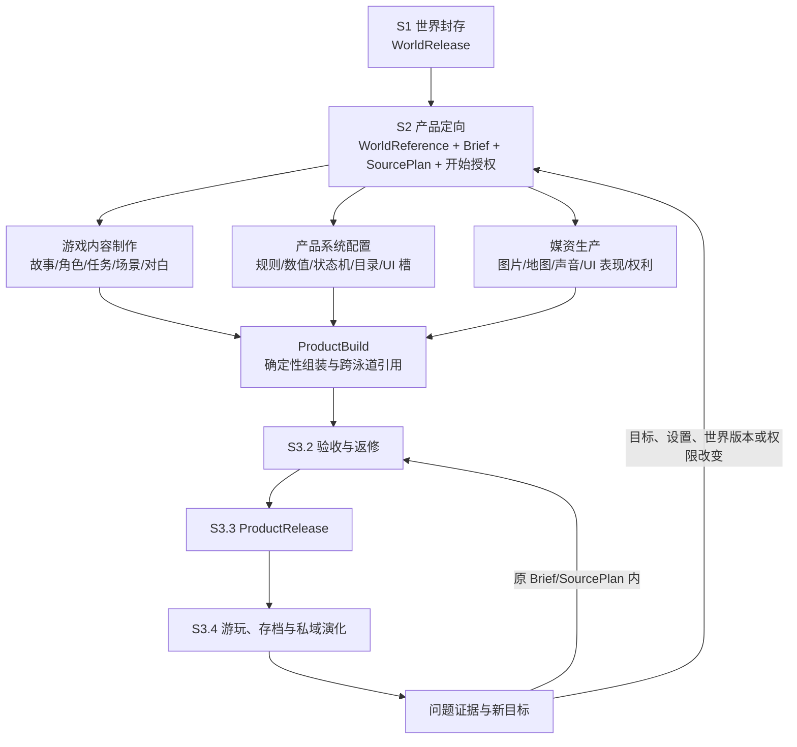

# StoryForge 游戏产品全生命周期完整性审查与补全建议

> 文档版本：1.1.0<br>
> 审查日期：2026-09-27；采纳复审：2026-09-28<br>
> 权威层级：L4 项目级审查<br>
> 状态：现行审查结论；七项原则已由总纲 1.9.0 和上层产品契约 2.6.0 采纳<br>
> 适用范围：跑团、角色聊天、AI 小镇、文字冒险、AVG、文字开放世界<br>
> 上位依据：`PROJECT-MASTER-CHARTER.md`、`UPPER-PRODUCTS.md`、`DATA-GOVERNANCE.md`、`HARNESS-QUALITY-STANDARD.md`、`ENGINEERING-QUALITY-STANDARD.md`

## 1. 文档目的与结论

本文审查 StoryForge 当前项目架构和游戏生产流程是否足以支持“AI 主导生产并运行完整叙事游戏”，并把已经成立的流程、仍不够明确的边界和建议补充项集中记录下来。

本文不修改现行产品边界，不新增产品身份，不声明任何产品已经商业完成。2026-09-28，本文第 6 节七项长期原则已经正式写入总纲 1.9.0，并同步进入上层产品契约 2.6.0；详细论证、缺口快照和后续验证任务仍以本文作为 L4 审查证据，发生冲突时以上位文档为准。

审查结论如下：

1. 当前 `S1 世界封存 → S2 产品定向 → S3 产品执行` 主链方向正确，已经覆盖来源、定向、生产、验收、发布、运行和私域演化，不需要再增加一个与 S1/S2/S3 并列的主阶段。
2. S3.1 的游戏内容制作、产品系统配置和媒资生产三条依赖式并行泳道能够覆盖一款游戏实例的主要生产责任，不需要机械增加第四条生产泳道。
3. 审查时最重要的缺口不是更多表、Agent 或阶段，而是显式区分“开发 StoryForge 游戏产品”与“用产品生产具体游戏”两种生命周期，并补强局部试玩返修、发布成熟度、运行时 AI、发布后维护和横切治理。
4. 如果不补这些表达，现有架构仍能跑通工程流程，但后续容易把产品软件研发、游戏实例配置、真实体验验收和版本维护混为同一类任务。

## 2. 两种不得混淆的生命周期

### 2.1 生命周期 A：StoryForge 游戏产品研发

这条生命周期负责开发“可以生产和运行某类游戏的工具与软件能力”。角色属性引擎、任务系统、背包系统、战斗运行时、作者工作台、玩家界面和编译器首先属于产品能力，不应由每个游戏实例重新生成一套代码。

```text
产品定位与专项契约
→ 作者需求、玩家体验与运行边界设计
→ 产品数据、表、Agent/Skill、编译器与 runtime 设计
→ 作者端 UI、玩家端 UI 和共享设施实现
→ 三注册表、schema、生命周期和迁移闭环
→ 工程测试、隔离 E2E 与真实产品体验验收
→ StoryForge 应用版本发布与持续维护
```

该生命周期的主要 owner 是 StoryForge 代码、产品专项契约、共享底座和应用版本。它服从项目总纲的发展阶段、分支治理和 Definition of Done，不用 `ProductRelease` 冒充应用软件发布。

### 2.2 生命周期 B：创作者生产一款具体游戏

这条生命周期发生在产品能力已经存在之后。创作者使用某个游戏产品，把冻结世界和产品意图生产为一个具体、不可变、可运行的 `ProductRelease`。



该生命周期的 owner 是 product instance、production、Artifact、media、build、`ProductRelease`、session 和 save。它不能反向改写世界引擎，也不能把一款游戏的配置伪装成共享产品代码。

### 2.3 两种生命周期的交界

| 问题 | 属于产品研发 | 属于具体游戏生产 |
|---|---|---|
| 有没有任务状态机、任务日志和任务 UI | 是 | 否 |
| 本游戏有哪些主线、支线、任务目标和奖励 | 否 | 是 |
| 有没有背包、装备、制作和交易能力 | 是 | 否 |
| 本游戏有哪些物品、配方、商店和经济参数 | 否 | 是 |
| 地图组件怎样交互、缩放、寻路和快速旅行 | 是 | 否 |
| 本游戏有哪些地区、地点、连接和地图表现 | 否 | 是 |
| 玩家界面的基础信息架构和可访问性 | 是 | 否 |
| 本游戏的 UI 文案、主题皮肤、头像和背景 | 部分基础槽位 | 具体内容与绑定 |
| Runtime 是否支持运行时 AI | 是 | 否 |
| 本游戏允许运行时 AI 做什么、预算多少 | 产品提供契约 | 具体 Release 配置 |

任何专项方案都应先标注讨论的是哪一种生命周期，避免把“实现系统”与“填写系统内容”写在同一个待办中。

## 3. 当前游戏实例生产全流程

### 3.1 S1 世界封存

输入可以来自用户直接创建、导入，或从已确认长篇/短篇内容显式派生的世界草稿。S1 负责确认语义、来源证据、稳定身份、能力画像和不可变版本，输出可通过 world code、release ID、hash 和 capability profile 定位的 `WorldRelease`。

S1 不生产游戏规则、媒资、Build、玩家存档或私域事件。世界内容可以包含小说正文及由正文确认的事实，但上层产品只通过中立版本化资源协议读取，不直接访问世界物理表。

### 3.2 S2 产品定向

用户进入具体产品后：

1. 选择并核对准确 `WorldRelease`；
2. 查看与该产品相关的来源能力、缺失、冲突和遗漏；
3. 确认产品类型、规模、目标体验、玩家身份、内容边界、玩法偏好、媒资偏好、预算和完成条件；
4. 与产品主 Agent 完成意图会谈；
5. 确认 `ConfirmedProductBrief`；
6. 由系统校验并冻结 `WorldReference`、`ProductSourcePlan` 和授权 revision；
7. 用户明确开始后进入 S3。

S2 决定“要制作什么”，不提前冒充已经生产完成的系统配置。它可以提供来源适配建议、范围估算、成本估算和缺口处理方案，但不得创建正式 production、媒资或 runtime。

### 3.3 S3.1 三条依赖式并行生产泳道

#### 游戏内容制作线

把来源与 Brief 转换为玩家实际经历的结构化内容，例如故事结构、角色与关系、地区与地点、章节或模组、主支线、任务、事件、场景、对白、选择、结局及长期内容供给。

模型适合承担创意、改编、叙事规划和开放式修订；正式产物必须具有稳定 ID、来源、版本、引用、状态和验证证据。

#### 产品系统配置线

把产品目标与内容需求转换为可执行配置，例如属性与成长、战斗与判定、物品与经济、任务生命周期、地图与时间、NPC 与关系、知识边界、行动/条件/效果、导演调度、存档分支和 UI 消费槽。

模型可以提出世界化语义和候选数值；稳定 ID、公式、边界、状态机、引用、事务和最终配置由确定性代码拥有。

#### 媒资生产线

根据稳定内容主体和系统消费槽形成地图、图标、头像/立绘、场景背景、UI 皮肤、音乐、环境音、音效、配音及其他媒资的需求、生成或导入、选择、修复、权利、版本和绑定。

媒资不得反向发明世界 Canon。失败时只能使用产品契约允许的程序化、文字、占位或静音降级，并留下明确证据。

### 3.4 ProductBuild 组装

三条泳道不直接互相原地写入，由确定性 Build Integrator 负责：

- 检查内容引用的角色、地点、任务、技能、物品、敌人和规则是否存在；
- 检查系统槽位所需内容和媒资是否具备；
- 验证稳定 ID、版本、owner、引用和作用域；
- 编译产品运行包、UI 投影和媒资清单；
- 生成缺失、冲突、悬空引用、未消费产物和降级报告；
- 记录输入 Artifact、编译器版本、Source Manifest 和质量证据；
- 计算返修后的最小失效与重建闭包。

Build Integrator 是跨泳道确定性组装职责，不应被误写成第四个创意生产 Agent，也不要求所有产品共用同一个游戏内容 schema。

### 3.5 S3.2 验收与局部返修

验收不应是生产末尾的一次大检查，而应支持逐步形成可玩切片：

```text
生成局部可玩切片
→ 立即试玩或自动重放
→ 定位到具体 Artifact / 配置 / 媒资
→ 局部修改或定向重新生成
→ 按依赖闭包使下游 stale
→ 局部重编译
→ 重放受影响路线
→ 合格后扩大到下一切片
```

作者可以直接编辑受治理产物，也可以让 Agent 提出局部修改。任何返修都必须产生新 revision/Artifact/Build，保留旧证据，不允许为了省事原地覆盖不可变 Release。

### 3.6 S3.3 发布

发布系统冻结不可变 `ProductRelease`，至少绑定：

- product instance 与产品身份；
- Brief revision、SourcePlan 和 `ProductSourceManifest`；
- ProductBuild、编译器/运行包版本和质量证据；
- 采用的内容、系统配置和媒资版本；
- 父 ProductRelease、兼容结论和回退信息；
- 运行时 AI、provider、成本和降级契约；
- 发布成熟度与尚未完成的人工验收。

正式发布表示形成可重复运行的冻结版本，不自动等于已经适合公开推荐、社区分发或商业销售。

### 3.7 S3.4 运行与私域演化

玩家 session 和 save 绑定准确 ProductRelease。玩家状态、选择、记忆、运行事件和私域生成内容属于产品 session，不回写世界或旧 ProductRelease。

仍在原 Brief、SourcePlan 和运行契约内的内容可以通过有限、可停止、可恢复的 run 演化；改变产品目标、世界版本、资源需求、权限或重要系统设置时，必须回到 S2 创建新的 production 和 release。

### 3.8 发布后维护循环

玩家游玩产生的问题证据应能够定位到具体 release、save、事件序列、Artifact、系统配置、媒资、模型调用和运行环境。修复后创建直接后继 ProductRelease，并执行：

- 受影响路线与反例重放；
- 新存档完整游玩；
- 旧存档兼容检查与迁移；
- 迁移失败时继续绑定旧 release 或明确回退；
- 导出、导入和完整备份往返；
- 修复说明、已知限制和版本谱系记录。

## 4. 还需补强的横切机制

### 4.1 运行时 AI 契约

每个产品必须区分生产时 AI 与运行时 AI，并明确：

- 发布前冻结什么，运行时允许生成什么；
- AI 可以读取哪些 release/session 来源；
- 可以改变哪些 session 私域状态；
- 能否创建任务、事件、NPC、地区、物品或媒资；
- 主线、关键角色、经济和规则的不可突破边界；
- 每回合/每会话/每存档的调用、费用、时延和上下文预算；
- provider 不可用、超预算、非法输出和结果未知时的降级；
- 运行内容的持久化、版本、回滚、审计和存档兼容。

运行时模型不能直接拥有确定性状态机，也不能通过自然语言声明修改已发布规则。

### 4.2 四层验收证据

| 验收层 | 要回答的问题 | 典型证据 |
|---|---|---|
| 结构与工程正确 | 数据、引用、状态机、版本、存档能否安全运行 | schema/属性测试、生命周期、CI、E2E |
| 可执行与可通关 | 已知路线能否运行、目标是否可达、是否存在死锁 | 编译检查、自动游玩、覆盖与不变量 |
| 玩家可理解 | 玩家能否从实际 UI、文本和线索中自行理解并推进 | 新会话探索测试、可见信息检查、真人观察 |
| 体验质量 | 故事、节奏、重复度、战斗、媒资和整体感受是否达到目标 | 预注册量表、作者试玩、独立玩家试玩和问题回执 |

自动 verifier 与 generator 必须分离；已知路线自动通关不能证明玩家能推理出路线；构建和测试全绿不能证明叙事质量。

### 4.3 发布成熟度

建议所有游戏型产品统一记录成熟度，但不强制共用一张物理表：

1. `engineering-playable`：工程链闭合，可启动和完成已知路线；
2. `creator-accepted`：创作者完成目标范围试玩并接受当前质量；
3. `player-validated`：独立玩家从新存档完成规定体验并提交回执；
4. `distribution-ready`：导入导出、权利、隐私、兼容、说明和分发包全部闭合。

创作者自娱自乐可以在工程可运行后直接发布和游玩，但系统不得因此把作品标成已经完成独立玩家或公开分发验收。

### 4.4 发布与分发边界

`ProductRelease` 表示不可变可运行版本；游戏包表示可搬运交付物；安装记录表示某工作区采用了哪个版本；社区条目表示一次外部发布。四者不能混成一个对象。

首版可以只支持本地正式发布、导出和隔离导入。云托管、社区分享、市场、计费和运营仍按总纲阶段 F 后置，但当前 Release 契约应为未来分发保留稳定身份、权利和兼容证据。

### 4.5 权利、安全、隐私和内容治理

每个 Build/Release 应能够说明：

- 世界、小说、用户上传内容和改编内容的来源与授权；
- 模型生成媒资、第三方素材、字体、音乐和规则文本的许可；
- Key、手稿、日志、截图、存档和外部请求的数据边界；
- 导入文件、Markdown/HTML、URL、模型输出和工具参数均按不可信输入处理；
- 产品允许的内容边界、年龄提示及未来公开分发时的审核策略；
- 运行时 AI 的 Prompt Injection、越权工具调用和私密知识泄露防护。

### 4.6 成本、性能和 provider 漂移

S2 应提供范围与成本估算；S3 Run Contract 执行硬预算和停止条件；Release 应冻结或记录模型、Skill、Prompt、provider 能力和实际用量。产品还应分别声明：

- 生产总预算和每条泳道预算；
- 运行时每回合、每会话和每月预算；
- 目标设备上的启动、存档、地图、战斗、检索和回合延迟；
- 模型升级、下线、能力变化和输出漂移后的兼容评测；
- provider 不具备参考图、种子、修复、结构化输出或上下文能力时的阻断/降级。

### 4.7 诊断、反馈和度量

系统应在用户授权和隐私边界内记录可复现诊断，而不是收集无目的数据。建议关注：

- 首个可玩切片耗时；
- 单次局部修改后的重建与重放耗时；
- 无关内容被重新生成的比例；
- 生产费用与运行费用；
- 自动检查发现率、返修轮数和失败恢复率；
- 任务完成率、卡住位置、重复任务/对白比例；
- 作者与独立玩家的体验评分及具体问题。

这些指标用于改进生产体系，不以单一分数替代叙事和玩法判断。

## 5. 缺口与优先级矩阵

下表保留 2026-09-27 审查快照。2026-09-28 已完成总纲与共同契约层的原则采纳；“当前基础”和“不补的风险”继续用于后续专项实现审计，不表示相应代码已经完成。

| 优先级 | 缺口 | 当前基础 | 不补的风险 | 建议落点 |
|---|---|---|---|---|
| P0 | 产品研发与游戏生产未显式分层 | 总纲发展阶段和 S1/S2/S3 分别存在 | 把系统开发与实例配置混在同一待办 | 总纲增加双生命周期原则 |
| P0 | 局部试玩、返修、重建和重放循环不够突出 | Build、repair、stale、验收已存在 | 退化为一次性全量生成，成本与质量不可控 | 总纲 S3.2 + 产品专项生产图 |
| P0 | 运行时 AI 缺少跨产品最小契约 | SourcePlan、session manifest、Harness 已存在 | 自由演绎越过主线、经济、权限或费用边界 | 上层产品共同契约 + 各产品 runtime contract |
| P0 | 自动可通关与真实体验验收未形成统一成熟度口径 | 工程质量标准和部分专项验收已有规定 | 测试全绿被误报为游戏质量完成 | 总纲质量定义 + Release metadata |
| P1 | Build Integrator 职责未单独说明 | ProductBuild、确定性组装和引用检查已存在 | 三条泳道产物无法可靠汇合或局部重建 | 总纲 S3.1/S3.2 交界 + 共享编译设施 |
| P1 | 发布后修复与旧存档兼容未形成用户流程 | ProductRelease lineage 和兼容规则已存在 | 修复覆盖旧版本、存档损坏或无法回退 | 上层产品共同契约 + 产品发布 UI |
| P1 | Release、游戏包、安装与社区条目边界不够统一 | 部分产品已有包导出和安装路径 | 本地发布被误认为公开分发 | 分发契约和未来平台接口 |
| P1 | 权利、安全、费用、provider 漂移没有统一进入 Build/Release 门 | 共享质量标准已有原则 | 作品可运行但不可安全持续使用或公开分发 | 总纲横切原则 + 产品质量门 |
| P2 | 生产效率与体验指标未形成统一观测口径 | 日志、receipt、部分评测已存在 | 只能知道成功/失败，无法优化生产体系 | 诊断/评测规范与产品仪表盘 |
| P2 | 多语言、无障碍与设备适配按产品落地不一致 | 通用 UI 标准和 locale 扩展存在 | 后期改造成本高 | 产品专项 UI/Release 契约 |

## 6. 已补入总纲的最小原则

本文没有整篇搬入总纲。2026-09-28 的正式修订只采纳以下长期原则：

1. **双生命周期原则**：StoryForge 产品能力研发与具体游戏实例生产是两条独立但衔接的生命周期；S1/S2/S3 描述后者，不替代前者的产品工程流程。
2. **可玩切片与局部返修原则**：S3.1/S3.2 必须支持局部试玩、问题定位、依赖失效、局部重建和受影响路线重放，不能只提供一次性全量生成。
3. **组装责任原则**：三条生产泳道通过确定性 Build Integrator 汇合；跨泳道引用、编译、失效和发布证据不能只由 Agent 自报。
4. **验收成熟度原则**：工程可运行、创作者接受、独立玩家验证和公开分发准备是不同证据，不得相互冒充。
5. **运行时 AI 原则**：生产时 AI 与运行时 AI 分离；运行时读取、写入、预算、降级、审计和存档兼容由产品契约机器化约束。
6. **发布后维护原则**：修复形成新的不可变 ProductRelease；旧存档升级必须显式兼容、迁移或继续绑定旧版，并保留回退路径。
7. **横切治理原则**：来源权利、安全隐私、成本性能、provider 能力和诊断证据必须进入产品 Build/Release 质量门。

具体 UI、表结构、字段、Agent 数量、生产 DAG、质量量表和分发包格式仍由各产品专项契约设计，不能在总纲中建立跨产品万能实现。

## 7. 每个游戏产品开工前必须回答的清单

### 产品工程

- 产品为用户解决什么问题，和其他五类游戏产品的边界是什么？
- 作者端与玩家端分别有哪些真实入口和完成结果？
- 哪些能力是产品代码，哪些内容由每个游戏实例配置？
- 产品 runtime、UI、编译器、存档和 Release 的 owner 是谁？

### S1/S2 来源与定向

- 产品需要世界提供哪些必读、选读、条件读取和禁止读取资源？
- 世界内容不足、冲突或只有小说原文时怎样适配和补全？
- Brief 必须让用户确认哪些目标、限制、规模、预算和完成条件？
- 什么行为构成“明确开始”，怎样冻结授权 revision？

### S3.1 生产

- 三条泳道分别生产什么 Artifact，哪些是必需、可选或允许降级？
- 内容需求怎样驱动系统目录和媒资槽位？
- 模型与确定性代码分别负责什么？
- 哪些工作可以并行，合并点和冲突规则是什么？

### Build、验收和返修

- ProductBuild 包含什么，怎样检查跨泳道引用？
- 最小可玩切片是什么，多久能第一次试玩？
- 哪些自动路线只证明可执行，哪些测试证明玩家可理解？
- 作者怎样直接编辑和向 Agent 提出修改？
- 修改一个 Artifact 后哪些下游 stale，怎样只重建必要部分？
- 哪些人工验收未完成时仍允许本地发布，UI 怎样诚实提示？

### 发布、运行与维护

- ProductRelease 冻结哪些内容、配置、媒资、来源和质量证据？
- 生产时 AI 与运行时 AI 的边界是什么？
- 玩家 session/save 怎样绑定 Release，运行时内容归谁？
- provider 不可用、超预算、延迟过高和非法输出时怎样降级？
- 新 Release 怎样兼容旧存档，失败时怎样继续旧版或回退？
- 本地发布、导出包、安装记录和社区发布怎样区分？

### 治理与真实质量

- 来源和媒资是否具有足够授权与可追溯性？
- Key、手稿、存档、日志和外部请求怎样保护？
- 目标设备上的性能、存储和模型费用预算是什么？
- 用什么指标发现重复、卡关、叙事失真和返修成本？
- 由谁完成作者试玩、独立玩家试玩和公开分发确认？

## 8. 明确不建议的做法

- 不新增与 S1/S2/S3 并列的 S4/S5 来重复表达发布和维护；它们已经属于 S3，应补全内部循环。
- 不把 UI、QA 或 Build Integrator机械改成第四、第五条创意生产泳道；产品 UI 首先属于产品研发，实例 UI 配置和媒资分别归系统线与媒资线，验收和组装是横切职责。
- 不为六类产品建立统一任务表、角色表、系统字段、Agent 数量或万能 Production DAG。
- 不把自动通关、模型自评、构建成功或页面可见当作真实玩家体验证据。
- 不让运行时 AI 直接修改 ProductRelease、共享世界、确定性状态机或未授权的私域数据。
- 不因未来社区和商业化尚未建设，就省略 Release 的稳定身份、权利、兼容和分发边界。

## 9. 采纳结果与后续动作

1. 已完成：总纲 1.9.0 采纳双生命周期、局部返修、Build Integrator、验收成熟度、运行时 AI、发布后维护和横切治理原则。
2. 已完成：`UPPER-PRODUCTS.md` 2.6.0 同步共同扩展槽位、运行/维护边界和架构级验收。
3. 待执行：选择文字开放世界作为首个完整应用对象，把七项原则映射到其整体产品架构、生产 DAG、Build、Runtime 和验收世界。
4. 待执行：用盐脊或后续完整验收世界验证“局部修改 → 立即试玩 → 问题定位 → 局部返修 → 重放受影响路线”。
5. 待验证：经一个真实产品验证后，再把确实通用的 Build、验收成熟度、诊断和维护能力提升到共享底座，避免提前抽象。

本文的采纳表示长期原则已经进入上位文档，不表示具体游戏产品已经实现相应 Build、运行时 AI、维护 UI 或完成真实玩家验收。实现状态仍以代码、测试和能力基线为准。
